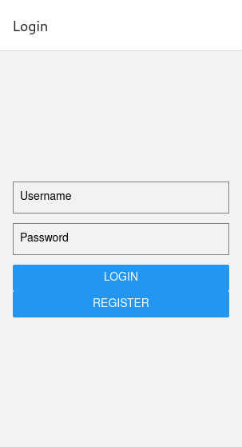
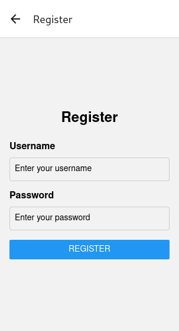
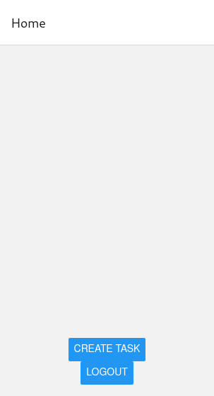
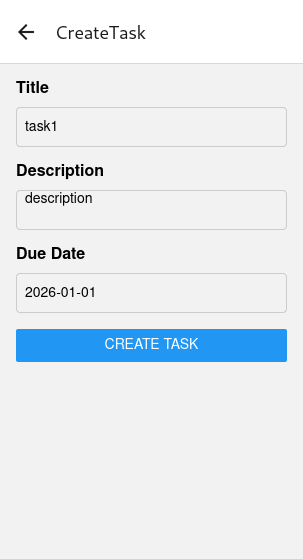
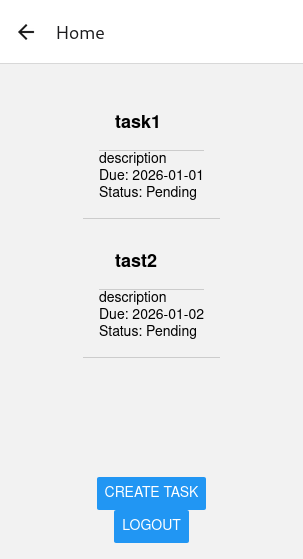
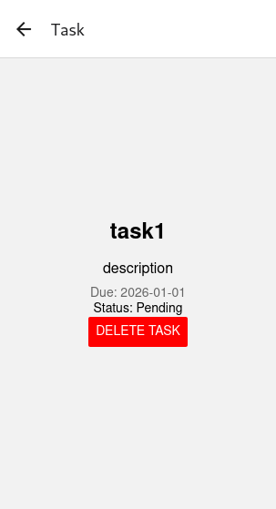

# My React Native App with Django GraphQL Backend

## Prerequisites

- Node.js
- Python
- Expo CLI

## Setup Instructions

Clone the Repository

#for the backend

cd core

python -m venv venv
source venv/bin/activate

pip install -r requirements.txt

python manage.py runserver

#for the frontend

cd frontend/

npm install

Update the GraphQL endpoint in apolloClient.js

npx expo start

